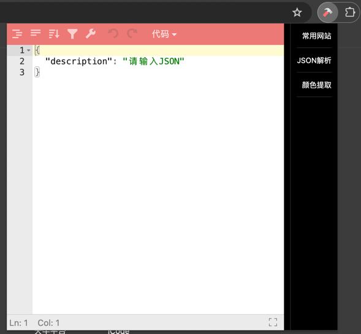
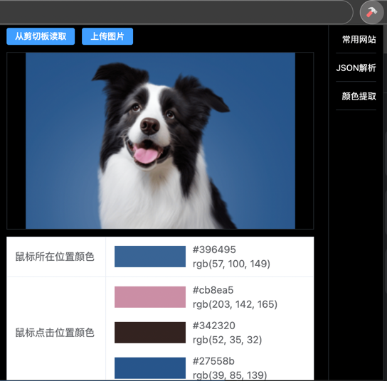
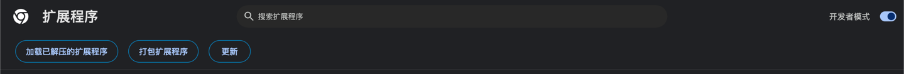
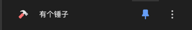

# 有个锤子-Chrome插件 

**专为Web前端同学开发的chrome浏览器插件助手**，提升日常工作效率，功能包括：
- 前端常用网站： 已支持
- JSON解析：已支持
- 图片颜色提取：已支持
- 代码生成：待开发
- 各种编码转换：待开发
- CSS色值转换：待开发
- 时间戳解析：待开发

使用效果：




# 使用方式

1. 下载仓库代码，插件放在chrome文件夹下。
2. 打开chrome浏览器的插件管理页面，打开「开发者模式」，点击「加载已解压的扩展程序」，选择代码仓库中的chrome文件夹。



3. 在扩展程序中将「有个锤子」设为常用，这样减少后续使用的操作



# 修改源码

## 开发插件页面

本项目完全利用前端主流技术（Vite+Vue3）开发插件页面，可轻松上手。
```shell
cd popup
npm i
npm run start
```
每次代码变更后，需要等待2-3秒，然后重新打开扩展程序查看效果，没办法，每次变更重新进行了build。

## 开发content-scripts

```shell
cd content-scripts
npm i
npm run start
```

## 开发service-worker

```shell
cd background
npm i
npm run start
```